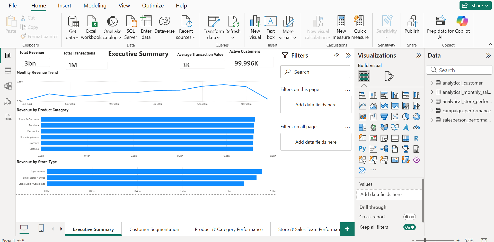
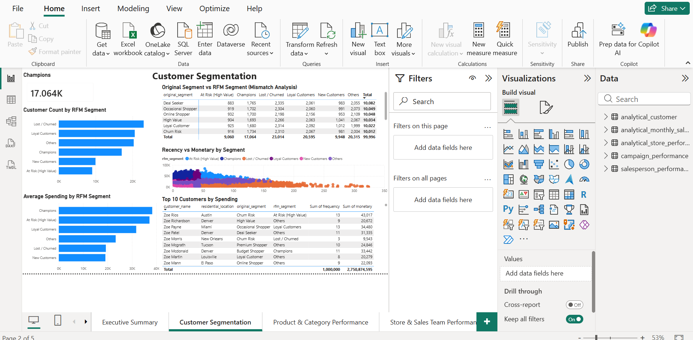
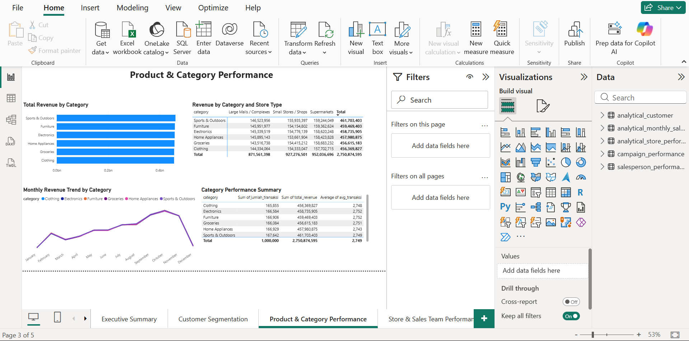
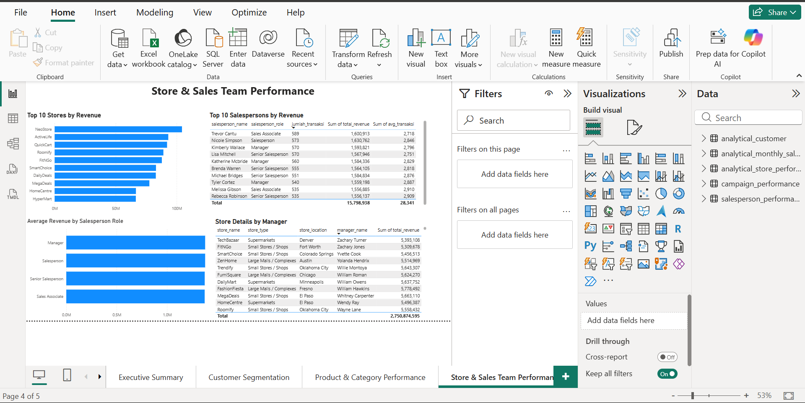
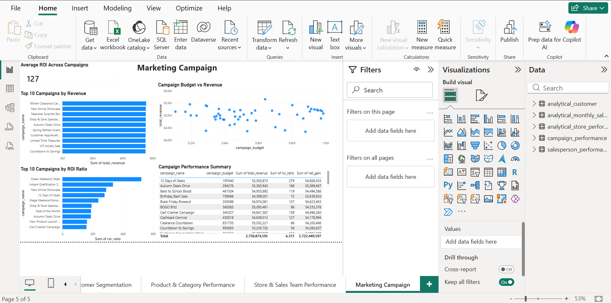

# Retail Analytics — End-to-End Data Analysis Project

Project analisis data ritel end-to-end: mulai dari integrasi data lintas divisi, data modeling, transformasi SQL, hingga dashboard interaktif di Power BI. Dibangun mengikuti pipeline standar data analyst di industri.

---

## 📌 Ringkasan Project

Menganalisis **1 juta transaksi penjualan ritel** sepanjang tahun 2024, mengintegrasikan data dari **5 fungsi bisnis** (Sales, Product Management, Customer/CRM, HR, Marketing) untuk menghasilkan insight lintas-divisi — termasuk validasi segmentasi customer melalui RFM Analysis, dan evaluasi efektivitas campaign marketing.

**Memvalidasi kualitas segmentasi pelanggan dan menemukan bahwa 47,1% pelanggan yang dikategorikan sebagai "Churn Risk" sebenarnya memiliki karakteristik pelanggan bernilai tinggi berdasarkan model RFM. Selain itu, mengungkap keterbatasan metrik ROI konvensional dalam mengevaluasi efektivitas campaign karena tidak memperhitungkan perbedaan skala investasi pada masing-masing campaign.

📄 Baca lengkap: [`insight-and-recommendation.md`](./insight-and-recommendation.md)

---

## 🗂️ Struktur Repository

```
retail-analytics-project/
│
├── README.md
├── data-modeling.md                       ← ERD & desain star schema
├── retail-analytics.sql                   ← seluruh query SQL Step 2-8
├── insight-and-recommendation.md          ← rangkuman insight & rekomendasi bisnis
│
├── insights/
│   ├── 01_executive-summary-insight.md
│   ├── 02_customer-segmentation-insight.md
│   ├── 03_product-category-performance-insight.md
│   ├── 04_store-sales-team-performance-insight.md
│   └── 05_marketing-campaign-insight.md
│
├── data/                                  
│   ├── Sumber_Data
│
├── dashboard/
│   └── retail-analytics.pbix
│
└── screenshots/
    ├── 01_Executive_Summary
    ├── 02_Customer_Segmentation
    ├── 03_Product_and_Category_Performance
    ├── 04_Store_and_Sales_Team_Performance
    └── 05_Marketing_Campaign
```

---

## 🔄 Pipeline yang Digunakan

Project ini mengikuti pipeline standar data analyst:

```
1. Business Understanding
2. Data Collection
3. Data Profiling / Data Quality Assessment
4. Data Cleaning
5. Data Modeling
6. Data Transformation
7. Exploratory Data Analysis (EDA)
8. Analytical Dataset Creation
9. Visualization & Dashboard Development
10. Insight & Recommendation
11. Documentation
12. Version Control & Publishing
```

| Tahap | Status | Dokumentasi |
|---|---|---|
| 1. Business Understanding | ✅ | Bagian "Ringkasan Project" di atas |
| 2. Data Collection | ✅ | Folder [`data/`](./data/) |
| 3. Data Profiling | ✅ | [`retail-analytics.sql`](./retail-analytics.sql) — Step 3 |
| 4. Data Cleaning | ✅ | [`retail-analytics.sql`](./retail-analytics.sql) — Step 4 |
| 5. Data Modeling | ✅ | [`data-modeling.md`](./data-modeling.md) |
| 6. Data Transformation | ✅ | [`retail-analytics.sql`](./retail-analytics.sql) — Step 6 |
| 7. EDA | ✅ | [`retail-analytics.sql`](./retail-analytics.sql) — Step 7 |
| 8. Analytical Dataset Creation | ✅ | [`retail-analytics.sql`](./retail-analytics.sql) — Step 8 |
| 9. Visualization & Dashboard | ✅ | Folder [`dashboard/`](./dashboard/), [`screenshots/`](./screenshots/) |
| 10. Insight & Recommendation | ✅ | [`insight-and-recommendation.md`](./insight-and-recommendation.md) |
| 11. Documentation | ✅ | File ini + folder [`insights/`](./insights/) |
| 12. Version Control & Publishing | ✅ | Repository ini |

---

## 🗃️ Sumber Data

Dataset: [Retail Store Star Schema Dataset (Kaggle)](https://www.kaggle.com/datasets/shrinivasv/retail-store-star-schema-dataset)

---

## 🧰 Tools & Tech Stack

| Tools | Fungsi |
|---|---|
| **DuckDB** | Data profiling, cleaning check, transformasi SQL, RFM Analysis |
| **SQL** | Seluruh query transformasi dan agregasi data |
| **Power BI** | Dashboard interaktif, visualisasi 5 halaman |
| **Mermaid.js** | Diagram ERD (ditulis dalam markdown, ter-render otomatis di GitHub) |

---

## 🏗️ Data Model

Star schema dengan 1 fact table (`fact_sales`, 1 juta baris) dan 6 dimension table, dihubungkan melalui surrogate key (`_sk`).

📄 Lihat diagram ERD lengkap: [`data-modeling.md`](./data-modeling.md)

---

## 📊 Dashboard — 5 Halaman

### 1. Executive Summary


Ringkasan KPI utama (total revenue, transaksi, customer aktif) dan tren revenue bulanan. Menemukan pola musiman yang jelas — puncak di Q3 (September–Oktober), turun tajam di akhir tahun.

📄 [Insight & rationale lengkap →](./insights/01_executive-summary-insight.md)

### 2. Customer Segmentation


Validasi segmentasi customer melalui RFM Analysis (Recency, Frequency, Monetary). Menemukan bahwa label segmentasi asli (`customer_segment`) tidak berkorelasi dengan perilaku transaksi aktual.

📄 [Insight & rationale lengkap →](./insights/02_customer-segmentation-insight.md)

### 3. Product & Category Performance


Analisis performa 6 kategori produk lintas waktu dan tipe toko. Menemukan distribusi revenue yang merata antar kategori, dengan pola musiman yang konsisten di semua kategori.

📄 [Insight & rationale lengkap →](./insights/03_product-category-performance-insight.md)

### 4. Store & Sales Team Performance


Analisis performa 500 toko dan 2.000 salesperson. Menemukan bahwa role/jabatan salesperson tidak mempengaruhi performa penjualan secara signifikan.

📄 [Insight & rationale lengkap →](./insights/04_store-sales-team-performance-insight.md)

### 5. Marketing Campaign


Evaluasi ROI 50 campaign marketing. Menemukan bahwa ROI Ratio yang tinggi pada beberapa campaign disebabkan oleh budget kecil, bukan efektivitas campaign yang lebih baik — revenue antar campaign relatif seragam terlepas dari besar budget.

📄 [Insight & rationale lengkap →](./insights/05_marketing-campaign-insight.md)

---

## 🔑 Key Findings

1. **Pola musiman jelas** — revenue naik di Q3, turun tajam di akhir tahun, berlaku merata di semua kategori produk
2. **Segmentasi customer existing tidak valid** — 47,1% customer berlabel "Churn Risk" ternyata bernilai tinggi berdasarkan RFM
3. **ROI campaign menyesatkan** — tidak ada korelasi antara budget dan revenue; ROI tinggi murni karena budget kecil
4. **Distribusi merata di banyak dimensi** — kategori, tipe toko, dan role sales tidak menunjukkan perbedaan performa signifikan

📄 Detail lengkap & rekomendasi bisnis: [`insight-and-recommendation.md`](./insight-and-recommendation.md)

---

## 🚀 Cara Reproduksi Project Ini

1. Download dataset dari [Kaggle](https://www.kaggle.com/datasets/shrinivasv/retail-store-star-schema-dataset), taruh di folder `data/`
2. Buka DuckDB, jalankan seluruh query di [`retail-analytics.sql`](./retail-analytics.sql) secara berurutan (Step 2 → Step 8)
3. Import 5 CSV hasil export (Step 8) ke Power BI
4. Bangun visual 5 halaman dashboard sesuai spesifikasi di masing-masing file `insights/*.md`

---

## Author

**Ahmad Farid**

- Email: [ahmad.fariden@gmail.com](mailto:ahmad.fariden@gmail.com)
- LinkedIn: [linkedin.com/in/ahmadfariden](https://linkedin.com/in/ahmadfariden)
- GitHub: [github.com/ahmadfariden](https://github.com/ahmadfariden)

Project ini dibangun sebagai portofolio data analytics — mencakup pipeline lengkap dari data cleaning, analisis berbasis SQL menggunakan DuckDB, hingga dashboard interaktif di Power BI.
