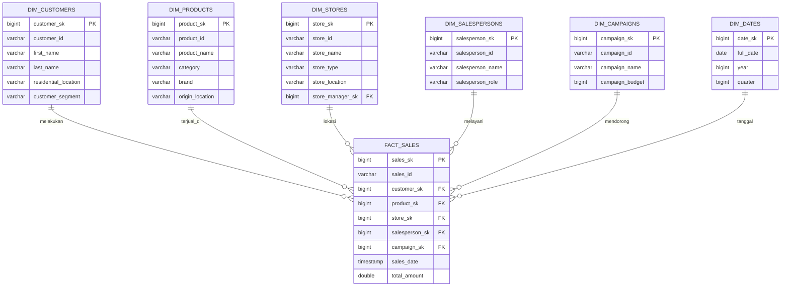

# Data Modeling — Retail Store Star Schema

## Ringkasan

Dataset ini menggunakan pendekatan **star schema**, dengan 1 fact table (`fact_sales`) di tengah dan 6 dimension table yang saling terhubung melalui surrogate key (`_sk`). Skema ini bersumber dari [Retail Store Star Schema Dataset (Kaggle)](https://www.kaggle.com/datasets/shrinivasv/retail-store-star-schema-dataset).

| Tabel | Jenis | Jumlah Baris | Sumber Divisi |
|---|---|---|---|
| `fact_sales` | Fact | 1.000.000 | Penjualan / Sales |
| `dim_customers` | Dimension | 100.000 | Customer / CRM |
| `dim_products` | Dimension | 210 | Produk / Product Management |
| `dim_stores` | Dimension | 500 | Operasional / Distribusi |
| `dim_salespersons` | Dimension | 2.000 | HR |
| `dim_campaigns` | Dimension | 50 | Marketing |
| `dim_dates` | Dimension | 366 | Calendar table (generated) |

## Entity Relationship Diagram

## Catatan Desain

- **Surrogate key (`_sk`)** dipakai untuk relasi antar tabel (JOIN), sedangkan **business key** (`customer_id`, `product_id`, dst) hanya untuk keperluan referensi/tampilan.
- **`dim_stores` memiliki FK ke `dim_salespersons`** (`store_manager_sk`) — pola snowflake kecil di dalam star schema, karena manager toko juga tercatat sebagai salesperson.
- **`fact_sales.sales_date`** sudah berbentuk timestamp lengkap, sehingga `dim_dates` bersifat opsional untuk agregasi cepat per `year`/`quarter`, bukan keharusan untuk join tanggal.
- Dataset **tidak menyertakan tabel Inventory/Stock**, sehingga seluruh analisis berbasis nilai transaksi (`total_amount`), bukan jumlah unit terjual.

## Hasil Data Profiling (Ringkasan)

| Pemeriksaan | Hasil |
|---|---|
| Missing values (semua tabel) | 0 |
| Duplicate ID (`sales_id`, `customer_id`, `product_id`) | 0 |
| Orphan record (referential integrity) | 0 di semua relasi |
| Transaksi dengan `total_amount` ≤ 0 | 0 |
| Rentang tanggal | 2024-01-02 s/d 2024-12-26 |

Data terverifikasi bersih dan siap digunakan untuk tahap transformasi dan analisis lanjutan.
